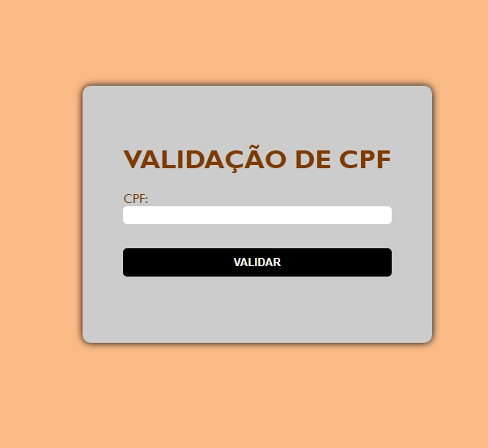

## validações

 ## Esse projeto, aprendemos a ultilizar javascript, 
 ## desenvolvemos dois sistemas de validação, para email e CPF

 * IMAGEM DO PROJETO

# Explicação do CPF:
O código é dividido em duas partes principais:

 * 1.dição de um escutador de eventos ao formulário para validação
*  2.Função validarCPF que realiza a verificação do CPF

 # Adicionando o Escutador de Eventos
Esta parte do código adiciona um escutador de eventos ao formulário de CPF para validar o CPF quando o formulário é enviado.

document.getElementById('cpfForm').addEventListener('submit', function(event){
    event.preventDefault();

    const cpf = document.getElementById('cpf').value; 
    const msg = document.getElementById('message');

    if(validarCPF(cpf)){
        msg.textContent = "O CPF é válido!";
        msg.style.color = 'green';
    } else {
        msg.textContent = "O CPF é inválido!";
        msg.style.color = 'red';
    }
});

# Captura do Formulário e Adição do Escutador:
document.getElementById('cpfForm').addEventListener('submit', function(event){
* Obtém o formulário com o ID cpfForm e adiciona um escutador de eventos para o evento de envio (submit).

# Prevenção do Envio do Formulário:
event.preventDefault();
* Impede o envio padrão do formulário para evitar recarregamento da página e executar a validação do CPF em vez disso.

# Obtenção do Valor do CPF e Mensagem:
const cpf = document.getElementById('cpf').value;
const msg = document.getElementById('message');
* Obtém o valor inserido no campo de CPF e o elemento onde a mensagem de validação será exibida.

# Validação do CPF e Atualização da Mensagem:

if(validarCPF(cpf)){
    msg.textContent = "O CPF é válido!";
    msg.style.color = 'green';
} else {
    msg.textContent = "O CPF é inválido!";
    msg.style.color = 'red';
}
* Chama a função validarCPF para verificar se o CPF é válido.
* Atualiza o conteúdo e a cor do texto da mensagem dependendo do resultado da validação.

 
# Explicação do email js:
* O código é dividido em duas funções que lidam com a validação e verificação do endereço de e-mail em um formulário HTML.
# Função checarEmail:
* Essa função tem o objetivo de verificar o e-mail informado no formulário é válido. 
function checarEmail(){
    if(document.forms[0].email.value == "" || document.forms[0].email.value.indexOf('@') == -1 || document.forms[0].email.value.indexOf('.') == -1)
    {
# Mensagem de erro e retorno:
alert("Por favor, informe um email válido"); return false;
* Exibe um alerta com a mensagem de erro e retorna false, o que pode impedir o envio do formulário ou a execução de outras ações dependentes desta função.

# Mensagem de sucesso e atualização do HTML:
alert("Email informado com sucesso!");
document.getElementById('email').innerHTML = document.forms[0].email.value;
* Se o e-mail for válido, exibe uma mensagem de sucesso.
* Atualiza o conteúdo do elemento com id='email' para mostrar o e-mail informado.

# Função verifica
Essa função é usada para verificar se o e-mail foi informado.
if(document.forms[0].email.value == 0 ){
* Aqui, há um problema: document.forms[0].email.value é uma string e não pode ser igual a 0. Para verificar se o campo está vazio, o correto seria document.forms[0].email.value == "".

# Mensagem de alerta e foco:

alert("por favor, informe seu E-mail");
document.frmEnvia.email.focus();
* Exibe um alerta pedindo para o usuário informar o e-mail.
Define o foco no campo de e-mail (document.frmEnvia.email.focus();). Note que document.frmEnvia deve ser substituído por document.forms[0], que é mais consistente com o código anterior.

# Retorno:
return false;
* Retorna false para indicar que a verificação falhou.

# Retorno padrão:
return true;
* Se o campo de e-mail não estiver vazio, a função retorna true, indicando que a verificação foi bem-sucedida.

  

  

